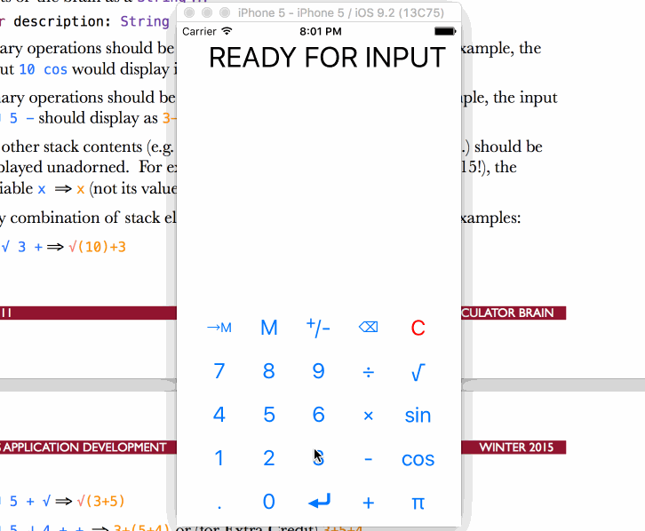
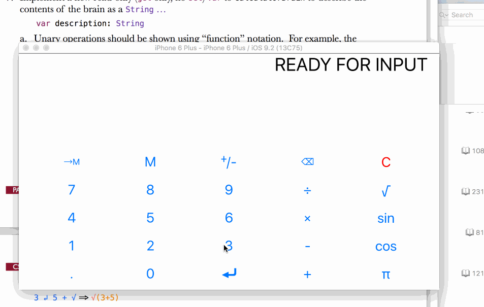

# cs193p-pa2

## Objective
You will start this assignment by enhancing your Assignment 1 Calculator to include the changes made in lecture (i.e. CalculatorBrain, etc.). This is the last assignment for which you will have to replicate code from lecture by typing it in.
Now that we’ve added an MVC Model to our Calculator, we’re going to push its capabilities a bit further. You will enhance your Calculator to allow the input of a “variable” into the Calculator’s stack. In addition, you’ll provide a way for the user to better see what has been entered so far.

## Main tasks
1. [x] All of the changes to the Calculator made in lecture must be applied to your Assignment 1. Get this fully functioning before proceeding to the rest of the Required Tasks. And, as last week, type the changes in, do not copy/paste from anywhere.
2. [x] Do not change any non-private API in CalculatorBrain and continue to use an enum as its primary internal data structure.
3. [x] Your UI should always be in sync with your Model (the CalculatorBrain).
4. [x] The extra credit item from last week to turn displayValue into a Double? (i.e, an Optional rather than a Double) is now required. displayValue should return nil whenever the contents of the display cannot be interpreted as a Double. Setting displayValue to nil should clear the display.
5. [x] Add the capability to your CalculatorBrain to allow the pushing of variables onto its internal stack. Do so by implementing the following API in your CalculatorBrain ...

      `func pushOperand(symbol: String) -> Double?`

      `var variableValues: Dictionary<String,Double>`

These must do exactly what you would imagine they would: the first pushes a “variable” onto your brain’s internal stack (e.g. pushOperand(“x”) would push a variable named x) and the second lets users of the CalculatorBrain set the value for any variable they wish (e.g. brain.variableValues[“x”] = 35.0). pushOperand should return the result of evaluate() after having pushed the variable (just like the other pushOperand does).

6. [x] The evaluate() function should use a variable’s value (from the variableValues dictionary) whenever a variable is encountered or return nil if it encounters a variable with no corresponding value.

7. [x] Implement a new read-only (`get` only, no `set`) var to CalculatorBrain to describe the contents of the brain as a `String` ...

      `var description: String`

  * [x] Unary operations should be shown using “function” notation. For example, the
input `10 cos` would display in the description as `cos(10)`.
  * [x] Binary operations should be shown using “infix” notation. For example, the input
`3 ↲ 5 -` should display as `3-5`. Be sure to get the order correct!
  * [x]  All other stack contents (e.g. operands, variables, constants like π, etc.) should be displayed unadorned. For example, 23.5 ⇒ 23.5, π ⇒ π (not 3.1415!), the variable x ⇒ x (not its value!), etc.
  * [x]  Any combination of stack elements should be properly displayed. Examples:

  `10 √ 3 + ⇒ √(10)+3`
  
  `3 ↲ 5 + √ ⇒ √(3+5)`
  
  `3 ↲ 5 ↲ 4 + + ⇒ 3+(5+4)` or (for Extra Credit) `3+5+4`
  
  `3 ↲ 5 √ + √ 6 ÷ ⇒ √(3+ √(5))÷6`

    * [x] If there are any missing operands, substitute a ? for them, e.g. `3 ↲ + ⇒ ?+3`.
    * [x] If there are multiple complete expressions on the stack, separate them by commas: for example, `3 ↲ 5 + √ π cos ⇒ √(3+5),cos(π)`. The expressions should be in historical order with the oldest at the beginning of the string and the most recently pushed/performed at the end.
    * [x] Your description must properly convey the mathematical expression. For example, `3 ↲ 5 ↲ 4 + *` must not output `3*5+4`—it must be `3*(5+4)`. In other words, you will need to sometimes add parentheses around binary operations. Having said that, try to minimize parentheses as much as you can (as long as the output is mathematically correct). See Extra Credit if you want to really do this well.

8. [x] Modify the UILabel you added last week to show your CalculatorBrain’s description instead. It should put an = on the end of it (and be positioned strategically so that the display looks like it’s the result of that =). This = was Extra Credit last week, but it is required this week.
9. [x] Add two new buttons to your Calculator’s keypad: →M and M. These 2 buttons will set and get (respectively) a variable in the CalculatorBrain called M.
  * [x] →M sets the value of the variable M in the brain to the current value of the display (if any)
  * [x] →M should not perform an automatic ↲ (though it should reset “user is in the middle of typing a number”)
  * [x] Touching M should push an M variable (not the value of M) onto the CalculatorBrain
  * [x] Touching either button should show the evaluation of the brain (i.e. the result of
evaluate()) in the display
  * [x] →M and M are Controller mechanics, not Model mechanics (though they both use
the Model mechanic of variables).
  * [x] This is not a very great “memory” button on our Calculator, but it’s good for testing whether our variable function implemented above is working properly. Examples ...

  `7 M + √` ⇒ description is `√(7+M)`, display is blank because M is not set
  `9 →M` ⇒ display now shows 4 (the square root of 16), description is still `√(7+M)`
  `14 +` ⇒ display now shows 18, description is now `√(7+M)+14`
10. [x] Make sure your C button from Assignment 1 works properly in this assignment.
11. [x] When you touch the C button, the M variable should be removed from the variableValues Dictionary in the CalculatorBrain (not set to zero or any other value). This will allow you to test the case of an “unset” variable (because it will make evaluate() return nil and thus your Calculator’s display will be empty if M is ever used without a →M).
12. [x] Your UI should look good on any size iPhone in both portrait and landscape (don’t worry about iPad until next week). This means setting up Autolayout properly, nothing more. 

## Pain points for this assignment AKA "stuff to learn"
1. Optionals
2. Closures
3. enum
4. switch
5. Dictionary
6. Tuples
7. Autolayout -- this can go fuck itself.
8. Recursion (not really an iOS thing, but something you should know!)

## Extra Credit
1. [x] Make your description have as few parentheses as possible for binary operations.
2. [x] Add Undo to your Calculator. In Assignment 1’s Extra Credit, you might have added “backspace”. Here we’re talking about combining both backspace and actual undo into a single button. If the user is in the middle of entering a number, this Undo button should be backspace. When the user is not in the middle of entering a number, it should undo the last thing that was done in the CalculatorBrain.
3. [x] Add a new method, evaluateAndReportErrors(). It should work like evaluate() except that if there is a problem of any kind evaluating the stack (not just unset variables or missing operands, but also divide by zero, square root of a negative number, etc.), instead of returning nil, it will return a String with what the problem is (if there are multiple problems, you can simply return any one of them you wish). Report any such errors in the display of your calculator (instead of just making it blank or showing some weird value). You must still implement evaluate() as specified in the Required Tasks above, but, if you want, you can have evaluate() return nil if there are any errors (not just in the “unset variable” or “not enough operands” case). The push and perform methods should still return Double? (which is kind of a wasted evaluation, but we want to be able to evaluate your Extra Credit separate from the Required Tasks).

##Demos and so forth
Four walkthroughs so it isn't one big gif...

First walkthrough shows the vanilla assignment.  I set variables and display formulas properly.  Basically follows the spec outlined in the main tasks section.  Probably some of the extra credit stuff is accidentally covered here as well, but is not very highlighted.

Next walkthrough shows undo functionality.  If you are typing a number, "undo" just erases stuff; if you screwed up an operation and want to do something else, "undo" will revert the operation and basically let you go back in time to recalculate whatever you want.

Third gif shows the four errors: divide by 0, square root of a negative number, not enough operands, and variable M not being set.

Last walkthrough highlights minimal parenthesis.  The special case I talk about in the "What could be better?" section is shown here.  I also do an unnecessarily contrived and large operation to show how robust the minimalistic parenthesis is.  Even for unary operations, parentheticals are not used unless absolutely necessary (e.g. to disambiguate `√5 + √3` versus `√(5+√3)`.  Thus, a unary operator without a parenthesis is operating on just the operand right next to it.

##What could be better?
  * My ability to not crawl up in a corner and cry when using auto-layout.
  * Behavior where you merge 2 separate stacks together is a bit tricky and not discussed at all in the assignment, if you had say:
    `(1+2+3)x4,4/5` and then you merge them with a multiply, everything is cool:  
    `(1+2+3)x4x4/5`; however, merge them with a divide and you will get a mismatch:  
    `(1+2+3)x4/4/5` will be on the history display, while the DFS algorithm will calculate:  
    `(1+2+3)x4/(4/5)`  
    Here, the precedence of divide and the preceding operator (multiply) and the succeeding operator (divide) are the same.  But the merging of two stacks implies there is a strict implicit parenthesis, but only for operations where order matters.  That is to say, the display would get confused in merging a "-" to a bunch of "+/-" and merging a "/" with a bunch of "*/-" by the nature of the description on how the extra credit should be done.

    Question: Why wouldn't merging "/" by confused by "+/-"?  
    Answer: I leave this as a thought exercise for the reader.  
    Real Answer: The conflict only arises when you are merging things with the same precedence, since you would assume there would be no parenthesis (e.g. 1+2-3 or 2/3*4 would have no parenethesis).  Merging a divide with a plus, or a minus with a multiply will give you the parenthesis for free since they are the of different precedence.

    Question 2: Why not have divides and multiply be of different precedence?  
    Answer: The common case like 1*2/4*3/5 or some continuous stream of multiply and divides would get screwed up.

  * Currently, overflows and underflows are +/-inf.  Perhaps they should be special cased out in evaluateAndReportErrors???
